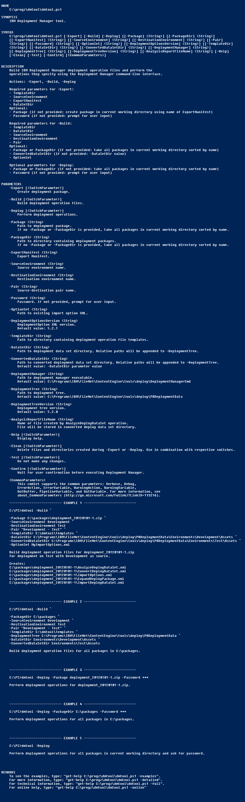

# dmtool



# Description

Build IBM Deployment Manager deployment operation files and perform the
operations they specify using the command-line interface.

# Allow running of PowerShell scripts

```
Set-ExecutionPolicy -Scope CurrentUser -ExecutionPolicy Bypass -Force
```

# Deployment operations

#### setup
* RetrievePrincipalInfoFromDomain
* RetrievePrincipalInfoFromDeployDataSet
* RetrieveObjectStoreInfoFromDomain
* RetrieveObjectStoreInfoFromDeployDataSet
* RetrieveServiceInfoFromDeployDataSet
* RetrieveInfoFromEnvironment
* CreateEnvironment
* ? ReassignObjectStore


#### source export
* ExportDeployDataSet
* CreateDeployPackage

#### destination import
* ExpandDeployPackage
* ConvertDeployDataSet
* AnalyzeDeployDataSet
* ImportDeployDataSet

#### ?
* MapData
* GenerateAuditReport
* UpgradeDeploymentTree
* RetrieveConnectionPointInfoFromDeployDataSet
* RetrieveConnectionPointInfoFromDomain


# To Do

* Required parameters check
* Params for now hardcoded per-deployment op. settings
* -CreateOptionSet
* doc aanpassen, geen otap, maar aanwijzing juiste s/d env en pair aangeven
* bij -deploy: aanmaken xmls als niet aanwezig
* -package bug? maakt dir in dir in datasetdir? (waarsch. expand)

#### optimization: load templates once!

```
function LoadTemplates {
    $names = @(
        "ExpandDeployPackage",
        "ConvertDeployDataSet",
        "AnalyzeDeployDataSet",
        "ImportDeployDataSet"
    )
    foreach ($name in $names) {
        [xml]$xml = Get-Content "$TemplateDir\$name.xml" -ErrorAction Stop
        $el = $xml.DeploymentOperation
        $el.deploymentTreeLocation = $DeploymentTree
        $el.version = $DeploymentTreeVersion
        $templates.add("$name.xml", $xml)
    }
    $templates
}

$templates = LoadTemplates
```

# Notes

* Using CLI doesn't write anything to C:\Programs\IBM\FileNet\ContentEngine\tools\deploy\deployment.log
* DeploymentManager.exe executes silently in background
* DeploymentManagerCmd.bat prints output and exits when completed
* Both commands DO NOT return an exit code > 0 on error, thus exit code can't be used to check for successful execution

# Links

Source repository:
https://github.com/RJK-Engineering/dmtool

Deployment operations reference:
https://www.ibm.com/support/knowledgecenter/SSNW2F_5.2.1/com.ibm.p8.common.deploy.doc/deploy_operation_formats.htm

Import options reference:
https://www.ibm.com/support/knowledgecenter/SSNW2F_5.2.1/com.ibm.p8.common.deploy.doc/deploy_mgr_command_line_importoptions_syntax.htm
